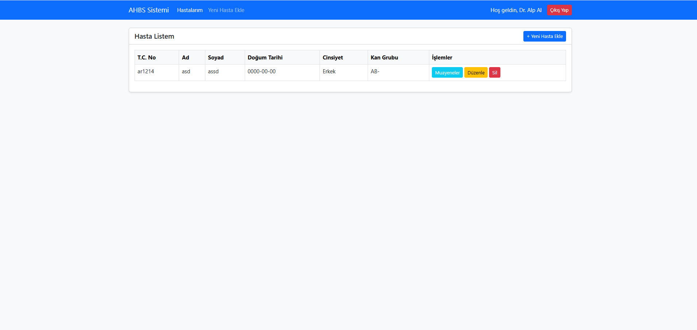
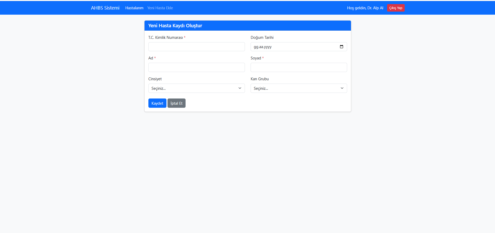

# Aile Hekimi Bilgi Sistemi (AHBS)

Bu proje, Bursa Teknik Üniversitesi "Veritabanı Yönetim Sistemleri" dersi final projesi kapsamında geliştirilmiştir. Sistem, aile hekimlerinin hastalarını ve hastalarına ait muayene kayıtlarını güvenli bir şekilde yönetebilmesini sağlayan yalın (framework kullanılmayan) web tabanlı bir uygulamadır.

## 🚀 Proje Özellikleri ve Kriterler

Ödev yönergesinde istenen tüm temel özellikler (CRUD işlemleri ve güvenlik standartları) projeye entegre edilmiştir:

* **Kullanıcı Kaydı:** Hekimler sisteme kayıt olabilir. Şifreler veritabanına düz metin olarak değil, `password_hash()` fonksiyonu ile şifrelenerek (hash'lenerek) kaydedilir.
* **Oturum Yönetimi:** Düz çerezler (cookies) yerine güvenli PHP Oturumları (`$_SESSION`) kullanılmıştır. Hekimler sadece kendi ekledikleri hastaları görebilir ve yönetebilir.
* **Bilgi Girişi (Create):** Hekim, kendi hesabına yeni hasta ve o hastaya ait muayene/teşhis kaydı ekleyebilir.
* **Bilgi Listeleme (Read):** Hekim, hastalarını ve hastalarına ait geçmiş muayene kayıtlarını listeleyebilir.
* **Bilgi Güncelleme (Update):** Sisteme eklenen hasta bilgileri sonradan düzenlenebilir.
* **Bilgi Silme (Delete):** Hekim, yetkisi dahilindeki hastaları sistemden silebilir.
* **Arayüz Tasarımı:** Kullanıcı arayüzünde "stillendirilmemiş" hiçbir HTML ögesi bırakılmamış, tüm tasarım **Bootstrap 5** kütüphanesi kullanılarak modern bir görünüme kavuşturulmuştur.

## 🛠️ Kullanılan Teknolojiler

* **Backend:** Yalın PHP
* **Veritabanı:** MySQL (Güvenli PDO bağlantısı ile)
* **Frontend:** HTML5, Bootstrap 5 (CSS & JS)
* **Sunucu:** Apache (Lokalde XAMPP, Canlıda tahsis edilen Hosting alanı)

---

## 🎥 Proje Tanıtım Videosu

Projenin nasıl çalıştığını, kod yapısını ve veritabanı işlemlerini anlattığım kısa tanıtım videosuna aşağıdaki bağlantıdan ulaşabilirsiniz:

▶️ **[Proje Tanıtım Videosunu İzlemek İçin Tıklayın]( BURAYA_YOUTUBE_VEYA_DRIVE_LINKINI_YAPISTIR )**

*(Not: Link bir Google Drive bağlantısıysa, erişim izninin "Bağlantıya sahip olan herkes görebilir" olarak ayarlandığından emin olunmuştur.)*

---

## 📸 Ekran Görüntüleri

Sistemin çalışır halini gösteren arayüz görüntüleri aşağıdadır:

**1. Hekim Giriş Sonrası Ekran**

**2. Hasta Ekleme**

---

